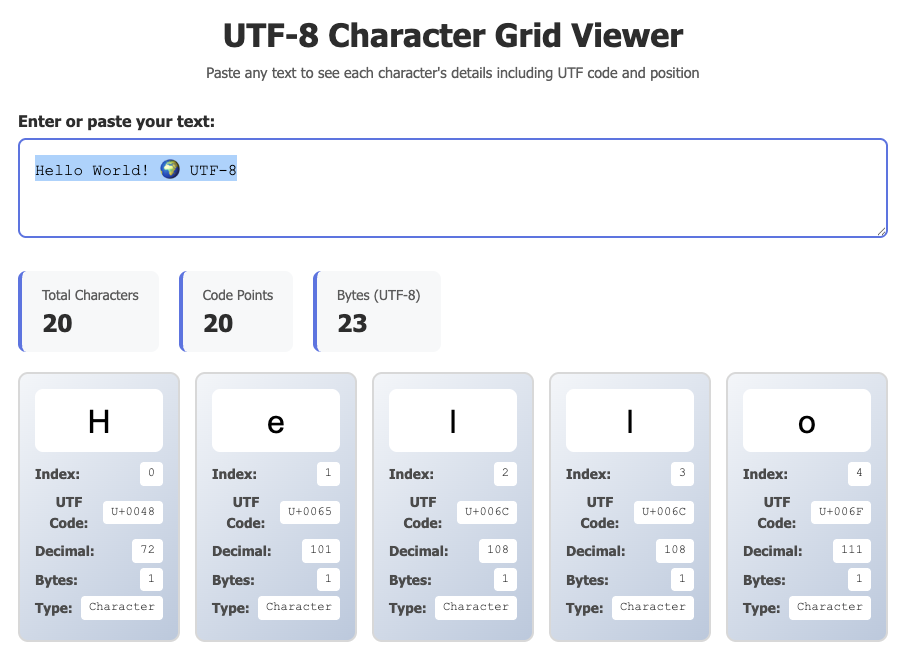

# UTFCharacterViewer

A small debugging tool to see the (byte) contents of UTF8 characters

See below for a screenshot.

 

## Credits

Development by [Ghent Centre for Digital Humanities - Ghent University](https://www.ghentcdh.ugent.be/). Funded by the [GhentCDH research projects](https://www.ghentcdh.ugent.be/projects).

